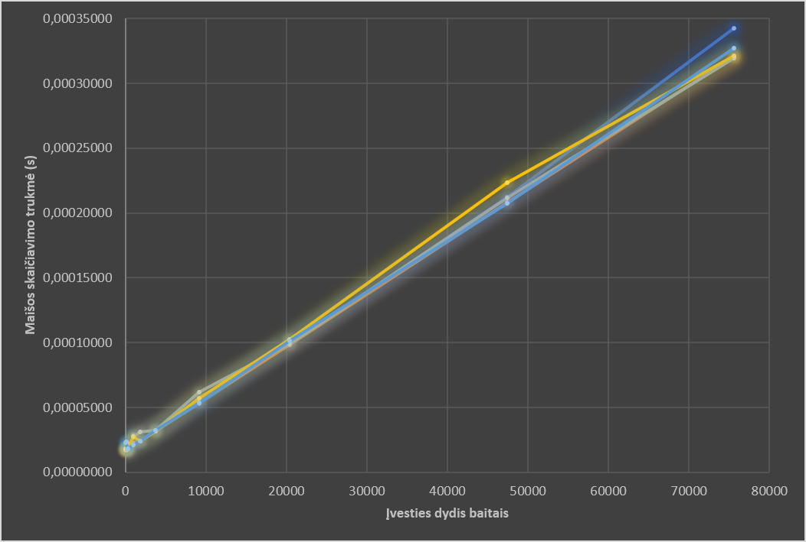
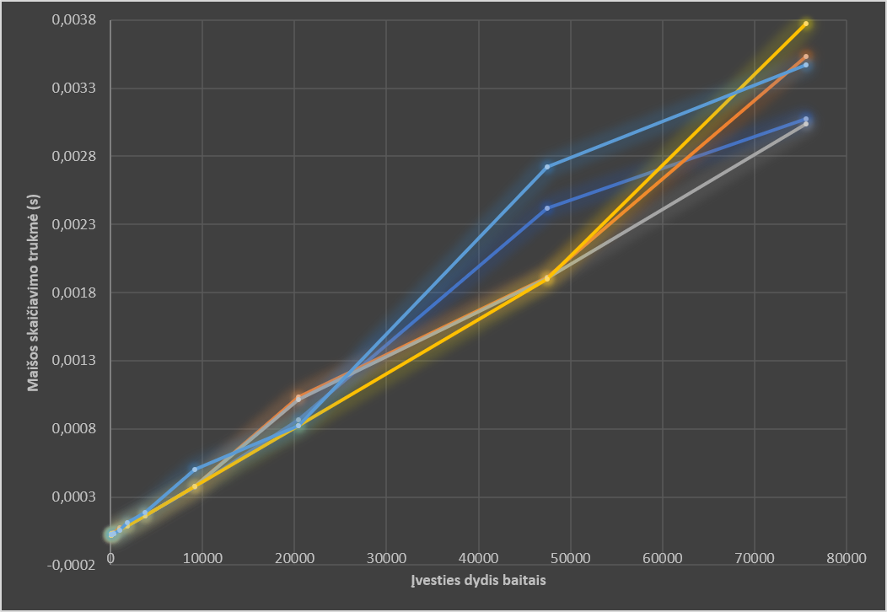
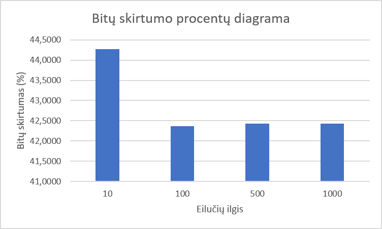
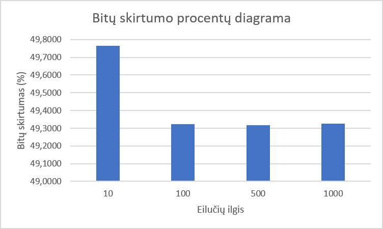

# Maišos generatorius

## Apie programą

- **Programos tikslas:** generuoti įvesto teksto maišą.
- Priimama tiek rankinis įvedimas (terminale), tiek failo įvestis (failą pasirenkant failų dialoge).
- Išvedama 256 bitų ilgio (32 šešioliktainių sk.) maiša, sugeneruota pagal įvestį.
- Į programą įtraukta ir maišos testavimo (eksperimentų) funkcijos (efektyvumo matavimas, kolizijos tyrimas, lavinos efekto tyrimas, spėjimo tyrimas).

## Kompiliavimas ir paleidimas

Paleidimo failo kūrimo komandos pvz. (naudojant g++ kompiliatorių):

- g++ -std=c++23 main.cpp maisos_fjos.cpp pagalb_fjos.cpp -o main -luuid

\*\* -luuid vėliavėlė reikalinga programoje naudojamai failų dialogų bibliotekai

Programa paleidžiama komanda ./main (jeigu programos pavadinimas — main.exe).

## Eksperimentai

### 1. Skirtingos įvestys

#### 1. Tuščias failas

- Turinys: tuščias failas
- Išvestis: 

#### 2. Vieno baito failai

###### Versija be DI

- Turinys: a
- Išvestis: 19b57af4e8e88000009c2850a0fc881020c8204080a93264c88bb66cd888b060

- Turinys: b
- Išvestis: ed59d2a4489e9c38705e9c387042a448909a54a8501efcf8f05af4e8d0f42850

###### Versija su DI

- Turinys: a
- Išvestis: f0d848a26ea2ac6d6f8676eee8f76426eba1d6893cb4f8c122f79eae3bbfc73f

- Turinys: b
- Išvestis: ea886bf5eadb35bcab5fd038d1bef45b7a3b73e3da079319f3de4b6f212c48c6

#### 3. ASCII >1000 baitų failai

##### 1. Lorem Ipsum tekstas (1311 B)

###### Versija be DI

- Turinys (originalus):
  - Lorem ipsum dolor sit amet, consectetur adipiscing elit, sed do eiusmod tempor incididunt ut labore et dolore magna aliqua. Ut enim ad minim veniam, quis nostrud exercitation ullamco laboris nisi ut aliquip ex ea commodo consequat. Duis aute irure dolor in reprehenderit in voluptate velit esse cillum dolore eu fugiat nulla pariatur. Excepteur sint occaecat cupidatat non proident, sunt in culpa qui officia deserunt mollit anim id est laborum. Sed ut perspiciatis unde omnis iste natus error sit voluptatem accusantium doloremque laudantium, totam rem aperiam, eaque ipsa quae ab illo inventore veritatis et quasi architecto beatae vitae dicta sunt explicabo. Nemo enim ipsam voluptatem quia voluptas sit aspernatur aut odit aut fugit, sed quia consequuntur magni dolores eos qui ratione voluptatem sequi nesciunt. Neque porro quisquam est, qui dolorem ipsum quia dolor sit amet, consectetur, adipisci velit, sed quia non numquam eius modi tempora incidunt ut labore et dolore magnam aliquam quaerat voluptatem. Ut enim ad minima veniam, quis nostrum exercitationem ullam corporis suscipit laboriosam, nisi ut aliquid ex ea commodi consequatur? Quis autem vel eum iure reprehenderit qui in ea voluptate velit esse quam nihil molestiae consequatur, vel illum qui dolorem eum fugiat quo voluptas nulla pariatur?
- Išvestis: b2e90fb6eccaf3503955c22790d5121e386d0ae2a504d23ebd4df94552be22cf

- Turinys (pakeistas pradžios baitas):
  - Korem ipsum dolor sit amet, consectetur adipiscing elit, sed do eiusmod tempor incididunt ut labore et dolore magna aliqua. Ut enim ad minim veniam, quis nostrud exercitation ullamco laboris nisi ut aliquip ex ea commodo consequat. Duis aute irure dolor in reprehenderit in voluptate velit esse cillum dolore eu fugiat nulla pariatur. Excepteur sint occaecat cupidatat non proident, sunt in culpa qui officia deserunt mollit anim id est laborum. Sed ut perspiciatis unde omnis iste natus error sit voluptatem accusantium doloremque laudantium, totam rem aperiam, eaque ipsa quae ab illo inventore veritatis et quasi architecto beatae vitae dicta sunt explicabo. Nemo enim ipsam voluptatem quia voluptas sit aspernatur aut odit aut fugit, sed quia consequuntur magni dolores eos qui ratione voluptatem sequi nesciunt. Neque porro quisquam est, qui dolorem ipsum quia dolor sit amet, consectetur, adipisci velit, sed quia non numquam eius modi tempora incidunt ut labore et dolore magnam aliquam quaerat voluptatem. Ut enim ad minima veniam, quis nostrum exercitationem ullam corporis suscipit laboriosam, nisi ut aliquid ex ea commodi consequatur? Quis autem vel eum iure reprehenderit qui in ea voluptate velit esse quam nihil molestiae consequatur, vel illum qui dolorem eum fugiat quo voluptas nulla pariatur?
- Išvestis: 12894f36ec8a7350399542279095921e38ad8ae2a5c4523ebd8d7945527ea2cf

- Turinys (pakeistas vidurio baitas):
  - Lorem ipsum dolor sit amet, consectetur adipiscing elit, sed do eiusmod tempor incididunt ut labore et dolore magna aliqua. Ut enim ad minim veniam, quis nostrud exercitation ullamco laboris nisi ut aliquip ex ea commodo consequat. Duis aute irure dolor in reprehenderit in voluptate velit esse cillum dolore eu fugiat nulla pariatur. Excepteur sint occaecat cupidatat non proident, sunt in culpa qui officia deserunt mollit anim id est laborum. Sed ut perspiciatis unde omnis iste natus error sit voluptatem accusantium doloremque laudantium, totam rem aperiam, eaque ipsa quae ab illo inventore veritatis et quasi architecto beatae vitae dicta sUnt explicabo. Nemo enim ipsam voluptatem quia voluptas sit aspernatur aut odit aut fugit, sed quia consequuntur magni dolores eos qui ratione voluptatem sequi nesciunt. Neque porro quisquam est, qui dolorem ipsum quia dolor sit amet, consectetur, adipisci velit, sed quia non numquam eius modi tempora incidunt ut labore et dolore magnam aliquam quaerat voluptatem. Ut enim ad minima veniam, quis nostrum exercitationem ullam corporis suscipit laboriosam, nisi ut aliquid ex ea commodi consequatur? Quis autem vel eum iure reprehenderit qui in ea voluptate velit esse quam nihil molestiae consequatur, vel illum qui dolorem eum fugiat quo voluptas nulla pariatur?
- Išvestis: 5835a7e6549a9390d9954227e075529f2a51d2759bf0aaf69d0d795fd6c6323b

- Turinys (pakeistas pabaigos baitas):
  - Lorem ipsum dolor sit amet, consectetur adipiscing elit, sed do eiusmod tempor incididunt ut labore et dolore magna aliqua. Ut enim ad minim veniam, quis nostrud exercitation ullamco laboris nisi ut aliquip ex ea commodo consequat. Duis aute irure dolor in reprehenderit in voluptate velit esse cillum dolore eu fugiat nulla pariatur. Excepteur sint occaecat cupidatat non proident, sunt in culpa qui officia deserunt mollit anim id est laborum. Sed ut perspiciatis unde omnis iste natus error sit voluptatem accusantium doloremque laudantium, totam rem aperiam, eaque ipsa quae ab illo inventore veritatis et quasi architecto beatae vitae dicta sunt explicabo. Nemo enim ipsam voluptatem quia voluptas sit aspernatur aut odit aut fugit, sed quia consequuntur magni dolores eos qui ratione voluptatem sequi nesciunt. Neque porro quisquam est, qui dolorem ipsum quia dolor sit amet, consectetur, adipisci velit, sed quia non numquam eius modi tempora incidunt ut labore et dolore magnam aliquam quaerat voluptatem. Ut enim ad minima veniam, quis nostrum exercitationem ullam corporis suscipit laboriosam, nisi ut aliquid ex ea commodi consequatur? Quis autem vel eum iure reprehenderit qui in ea voluptate velit esse quam nihil molestiae consequatur, vel illum qui dolorem eum fugiat quo voluptas nulla pariatur!
- Išvestis: 39f72bead49a9386252d726790d512c0fcf519e52b10e715eba9a7aa9c522cf9

###### Versija su DI

- Turinys (originalus):
  - Lorem ipsum dolor sit amet, consectetur adipiscing elit, sed do eiusmod tempor incididunt ut labore et dolore magna aliqua. Ut enim ad minim veniam, quis nostrud exercitation ullamco laboris nisi ut aliquip ex ea commodo consequat. Duis aute irure dolor in reprehenderit in voluptate velit esse cillum dolore eu fugiat nulla pariatur. Excepteur sint occaecat cupidatat non proident, sunt in culpa qui officia deserunt mollit anim id est laborum. Sed ut perspiciatis unde omnis iste natus error sit voluptatem accusantium doloremque laudantium, totam rem aperiam, eaque ipsa quae ab illo inventore veritatis et quasi architecto beatae vitae dicta sunt explicabo. Nemo enim ipsam voluptatem quia voluptas sit aspernatur aut odit aut fugit, sed quia consequuntur magni dolores eos qui ratione voluptatem sequi nesciunt. Neque porro quisquam est, qui dolorem ipsum quia dolor sit amet, consectetur, adipisci velit, sed quia non numquam eius modi tempora incidunt ut labore et dolore magnam aliquam quaerat voluptatem. Ut enim ad minima veniam, quis nostrum exercitationem ullam corporis suscipit laboriosam, nisi ut aliquid ex ea commodi consequatur? Quis autem vel eum iure reprehenderit qui in ea voluptate velit esse quam nihil molestiae consequatur, vel illum qui dolorem eum fugiat quo voluptas nulla pariatur?
- Išvestis: b6d80d8f4aedff6cdd58cc5858fe3257416c6ac457ca8131aae2db2009db4d68

- Turinys (pakeistas pradžios baitas):
  - Korem ipsum dolor sit amet, consectetur adipiscing elit, sed do eiusmod tempor incididunt ut labore et dolore magna aliqua. Ut enim ad minim veniam, quis nostrud exercitation ullamco laboris nisi ut aliquip ex ea commodo consequat. Duis aute irure dolor in reprehenderit in voluptate velit esse cillum dolore eu fugiat nulla pariatur. Excepteur sint occaecat cupidatat non proident, sunt in culpa qui officia deserunt mollit anim id est laborum. Sed ut perspiciatis unde omnis iste natus error sit voluptatem accusantium doloremque laudantium, totam rem aperiam, eaque ipsa quae ab illo inventore veritatis et quasi architecto beatae vitae dicta sunt explicabo. Nemo enim ipsam voluptatem quia voluptas sit aspernatur aut odit aut fugit, sed quia consequuntur magni dolores eos qui ratione voluptatem sequi nesciunt. Neque porro quisquam est, qui dolorem ipsum quia dolor sit amet, consectetur, adipisci velit, sed quia non numquam eius modi tempora incidunt ut labore et dolore magnam aliquam quaerat voluptatem. Ut enim ad minima veniam, quis nostrum exercitationem ullam corporis suscipit laboriosam, nisi ut aliquid ex ea commodi consequatur? Quis autem vel eum iure reprehenderit qui in ea voluptate velit esse quam nihil molestiae consequatur, vel illum qui dolorem eum fugiat quo voluptas nulla pariatur?
- Išvestis: 90f3afb5e8f7eb08b97c9c4620d372c1d96d2e0a2fed0c7f2a3857c0f5b876b1

- Turinys (pakeistas vidurio baitas):
  - Lorem ipsum dolor sit amet, consectetur adipiscing elit, sed do eiusmod tempor incididunt ut labore et dolore magna aliqua. Ut enim ad minim veniam, quis nostrud exercitation ullamco laboris nisi ut aliquip ex ea commodo consequat. Duis aute irure dolor in reprehenderit in voluptate velit esse cillum dolore eu fugiat nulla pariatur. Excepteur sint occaecat cupidatat non proident, sunt in culpa qui officia deserunt mollit anim id est laborum. Sed ut perspiciatis unde omnis iste natus error sit voluptatem accusantium doloremque laudantium, totam rem aperiam, eaque ipsa quae ab illo inventore veritatis et quasi architecto beatae vitae dicta sUnt explicabo. Nemo enim ipsam voluptatem quia voluptas sit aspernatur aut odit aut fugit, sed quia consequuntur magni dolores eos qui ratione voluptatem sequi nesciunt. Neque porro quisquam est, qui dolorem ipsum quia dolor sit amet, consectetur, adipisci velit, sed quia non numquam eius modi tempora incidunt ut labore et dolore magnam aliquam quaerat voluptatem. Ut enim ad minima veniam, quis nostrum exercitationem ullam corporis suscipit laboriosam, nisi ut aliquid ex ea commodi consequatur? Quis autem vel eum iure reprehenderit qui in ea voluptate velit esse quam nihil molestiae consequatur, vel illum qui dolorem eum fugiat quo voluptas nulla pariatur?
- Išvestis: f68eb3fdbba85db2bd36ceb6e675f1e3cf99358337bcb512924694fe37f352b4

- Turinys (pakeistas pabaigos baitas):
  - Lorem ipsum dolor sit amet, consectetur adipiscing elit, sed do eiusmod tempor incididunt ut labore et dolore magna aliqua. Ut enim ad minim veniam, quis nostrud exercitation ullamco laboris nisi ut aliquip ex ea commodo consequat. Duis aute irure dolor in reprehenderit in voluptate velit esse cillum dolore eu fugiat nulla pariatur. Excepteur sint occaecat cupidatat non proident, sunt in culpa qui officia deserunt mollit anim id est laborum. Sed ut perspiciatis unde omnis iste natus error sit voluptatem accusantium doloremque laudantium, totam rem aperiam, eaque ipsa quae ab illo inventore veritatis et quasi architecto beatae vitae dicta sunt explicabo. Nemo enim ipsam voluptatem quia voluptas sit aspernatur aut odit aut fugit, sed quia consequuntur magni dolores eos qui ratione voluptatem sequi nesciunt. Neque porro quisquam est, qui dolorem ipsum quia dolor sit amet, consectetur, adipisci velit, sed quia non numquam eius modi tempora incidunt ut labore et dolore magnam aliquam quaerat voluptatem. Ut enim ad minima veniam, quis nostrum exercitationem ullam corporis suscipit laboriosam, nisi ut aliquid ex ea commodi consequatur? Quis autem vel eum iure reprehenderit qui in ea voluptate velit esse quam nihil molestiae consequatur, vel illum qui dolorem eum fugiat quo voluptas nulla pariatur!
- Išvestis: b82213ce1454244f87266c6620fc3ad037a2f91d15259d1aa0691db8a52bfc33

##### 2. Pavyzdinis angliškas tekstas (pirminis tekstas — 1086 B)

###### Versija be DI

- Turinys (originalus):
  - Far far away, behind the word mountains, far from the countries Vokalia and Consonantia, there live the blind texts. Separated they live in Bookmarksgrove right at the coast of the Semantics, a large language ocean. A small river named Duden flows by their place and supplies it with the necessary regelialia. It is a paradisematic country, in which roasted parts of sentences fly into your mouth. Even the all-powerful Pointing has no control about the blind texts it is an almost unorthographic life One day however a small line of blind text by the name of Lorem Ipsum decided to leave for the far World of Grammar. The Big Oxmox advised her not to do so, because there were thousands of bad Commas, wild Question Marks and devious Semikoli, but the Little Blind Text didn't listen. She packed her seven versalia, put her initial into the belt and made herself on the way. When she reached the first hills of the Italic Mountains, she had a last view back on the skyline of her hometown Bookmarksgrove, the headline of Alphabet Village and the subline of her own road, the Line Lane.
- Išvestis: 70a66700a772b9df2b4cae1f85ece8d5e6e0f0f5170e5e9cd569ecdb15dbd1b6

- Turinys (pakeistas pradžios baitas):
  - Par far away, behind the word mountains, far from the countries Vokalia and Consonantia, there live the blind texts. Separated they live in Bookmarksgrove right at the coast of the Semantics, a large language ocean. A small river named Duden flows by their place and supplies it with the necessary regelialia. It is a paradisematic country, in which roasted parts of sentences fly into your mouth. Even the all-powerful Pointing has no control about the blind texts it is an almost unorthographic life One day however a small line of blind text by the name of Lorem Ipsum decided to leave for the far World of Grammar. The Big Oxmox advised her not to do so, because there were thousands of bad Commas, wild Question Marks and devious Semikoli, but the Little Blind Text didn't listen. She packed her seven versalia, put her initial into the belt and made herself on the way. When she reached the first hills of the Italic Mountains, she had a last view back on the skyline of her hometown Bookmarksgrove, the headline of Alphabet Village and the subline of her own road, the Line Lane.
- Išvestis: d6801b68772e31cf0b60d66f252860c5c69458c5b72a960cb5bd942bb5d7c9a6

- Turinys (pakeistas vidurio baitas):
  - Far far away, behind the word mountains, far from the countries Vokalia and Consonantia, there live the blind texts. Separated they live in Bookmarksgrove right at the coast of the Semantics, a large language ocean. A small river named Duden flows by their place and supplies it with the necessary regelialia. It is a paradisematic country, in which roasted parts of sentences fly into your mouth. Even the all-powerful Pointing has no control about the blind texts it is an almost unorthographic life One day however a small line of blind text by the name of Lorem Ipsum decided to leave for the far World of Grammar. The Big oxmox advised her not to do so, because there were thousands of bad Commas, wild Question Marks and devious Semikoli, but the Little Blind Text didn't listen. She packed her seven versalia, put her initial into the belt and made herself on the way. When she reached the first hills of the Italic Mountains, she had a last view back on the skyline of her hometown Bookmarksgrove, the headline of Alphabet Village and the subline of her own road, the Line Lane.
- Išvestis: c44eb7a0f712f95f5bac6e9f150c28569844b88a61a286fbd365e4f911d3c11f

- Turinys (pakeistas pabaigos baitas):
  - Far far away, behind the word mountains, far from the countries Vokalia and Consonantia, there live the blind texts. Separated they live in Bookmarksgrove right at the coast of the Semantics, a large language ocean. A small river named Duden flows by their place and supplies it with the necessary regelialia. It is a paradisematic country, in which roasted parts of sentences fly into your mouth. Even the all-powerful Pointing has no control about the blind texts it is an almost unorthographic life One day however a small line of blind text by the name of Lorem Ipsum decided to leave for the far World of Grammar. The Big Oxmox advised her not to do so, because there were thousands of bad Commas, wild Question Marks and devious Semikoli, but the Little Blind Text didn't listen. She packed her seven versalia, put her initial into the belt and made herself on the way. When she reached the first hills of the Italic Mountains, she had a last view back on the skyline of her hometown Bookmarksgrove, the headline of Alphabet Village and the subline of her own road, the Line Lane?
- Išvestis: 73ac6f5047b22e897ff3dbb9b9535065061e3ccdc76a87aef9a6b8b3c51b449c

###### Versija su DI

- Turinys (originalus):
  - Far far away, behind the word mountains, far from the countries Vokalia and Consonantia, there live the blind texts. Separated they live in Bookmarksgrove right at the coast of the Semantics, a large language ocean. A small river named Duden flows by their place and supplies it with the necessary regelialia. It is a paradisematic country, in which roasted parts of sentences fly into your mouth. Even the all-powerful Pointing has no control about the blind texts it is an almost unorthographic life One day however a small line of blind text by the name of Lorem Ipsum decided to leave for the far World of Grammar. The Big Oxmox advised her not to do so, because there were thousands of bad Commas, wild Question Marks and devious Semikoli, but the Little Blind Text didn't listen. She packed her seven versalia, put her initial into the belt and made herself on the way. When she reached the first hills of the Italic Mountains, she had a last view back on the skyline of her hometown Bookmarksgrove, the headline of Alphabet Village and the subline of her own road, the Line Lane.
- Išvestis: 97d909860345a8d3e47333dd004db125b22d02851eddb0bc23561f4cf78ceb23

- Turinys (pakeistas pradžios baitas):
  - Par far away, behind the word mountains, far from the countries Vokalia and Consonantia, there live the blind texts. Separated they live in Bookmarksgrove right at the coast of the Semantics, a large language ocean. A small river named Duden flows by their place and supplies it with the necessary regelialia. It is a paradisematic country, in which roasted parts of sentences fly into your mouth. Even the all-powerful Pointing has no control about the blind texts it is an almost unorthographic life One day however a small line of blind text by the name of Lorem Ipsum decided to leave for the far World of Grammar. The Big Oxmox advised her not to do so, because there were thousands of bad Commas, wild Question Marks and devious Semikoli, but the Little Blind Text didn't listen. She packed her seven versalia, put her initial into the belt and made herself on the way. When she reached the first hills of the Italic Mountains, she had a last view back on the skyline of her hometown Bookmarksgrove, the headline of Alphabet Village and the subline of her own road, the Line Lane.
- Išvestis: 0139180189698f5a12195b5856d658f57246f2eb4a002e4b61317ec345445829

- Turinys (pakeistas vidurio baitas):
  - Far far away, behind the word mountains, far from the countries Vokalia and Consonantia, there live the blind texts. Separated they live in Bookmarksgrove right at the coast of the Semantics, a large language ocean. A small river named Duden flows by their place and supplies it with the necessary regelialia. It is a paradisematic country, in which roasted parts of sentences fly into your mouth. Even the all-powerful Pointing has no control about the blind texts it is an almost unorthographic life One day however a small line of blind text by the name of Lorem Ipsum decided to leave for the far World of Grammar. The Big oxmox advised her not to do so, because there were thousands of bad Commas, wild Question Marks and devious Semikoli, but the Little Blind Text didn't listen. She packed her seven versalia, put her initial into the belt and made herself on the way. When she reached the first hills of the Italic Mountains, she had a last view back on the skyline of her hometown Bookmarksgrove, the headline of Alphabet Village and the subline of her own road, the Line Lane.
- Išvestis: 951d0c2998481e9453dd56a251942e9bf3e6ba066e92f7458151ab56ef380832

- Turinys (pakeistas pabaigos baitas):
  - Far far away, behind the word mountains, far from the countries Vokalia and Consonantia, there live the blind texts. Separated they live in Bookmarksgrove right at the coast of the Semantics, a large language ocean. A small river named Duden flows by their place and supplies it with the necessary regelialia. It is a paradisematic country, in which roasted parts of sentences fly into your mouth. Even the all-powerful Pointing has no control about the blind texts it is an almost unorthographic life One day however a small line of blind text by the name of Lorem Ipsum decided to leave for the far World of Grammar. The Big Oxmox advised her not to do so, because there were thousands of bad Commas, wild Question Marks and devious Semikoli, but the Little Blind Text didn't listen. She packed her seven versalia, put her initial into the belt and made herself on the way. When she reached the first hills of the Italic Mountains, she had a last view back on the skyline of her hometown Bookmarksgrove, the headline of Alphabet Village and the subline of her own road, the Line Lane?
- Išvestis: 1c058942e56f739bb242377bf6d3ee635c50da81a04d47d0e925e1813b0069ed

#### 4. Struktūruoti atvejai

##### 1. Pasikartojantys simboliai

###### Versija be DI

- Turinys: aaaaaaaaaaaaaaa
- Išvestis: 37b674f064ff7562b16793f00880b01e76e6462eca016fc3a08f6e927adfae7d

- Turinys: aaaaaaaaaaaaaa
- Išvestis: 2fa6542916633e606ddf881da2b425325eb60d92129104409a84b5198800071a

- Turinys: AAAAAAAAAAAAAAA
- Išvestis: eef4c059de455370a526e86f6eb1770c4a8375743ec8dc548ae7a209a8c90e6a

- Turinys: AAAAAAAAAAAAAA
- Išvestis: ff160534d4312c16b13e1bb0303587feeecb1fce7230fa83e8a406aaea50d98b

###### Versija su DI

- Turinys: aaaaaaaaaaaaaaa
- Išvestis: 644b95ac8806808226a86279c2ba245ce53206d33af6ed7c85c0c609e2d0c0f0

- Turinys: aaaaaaaaaaaaaa
- Išvestis: 94eef836fbb22e2b95d9c72b7dc58c1815bf575cba3061fc7752e917d4be98f7

- Turinys: AAAAAAAAAAAAAAA
- Išvestis: 5ea2f78d3a4f635788886e53bd03da53186f1a4aaa27da52ad9d1d1291a8becd

- Turinys: AAAAAAAAAAAAAA
- Išvestis: 385d768f61b244268fd5594eee5c54bae64cb7d7faeda6e2c7442b1687ec8614

##### 2. Pakeista simbolių tvarka

###### Versija be DI

- Turinys: ab
- Išvestis: 654b256ad4bc36cc98c1f0c080992468d0c18c38705304c890780a54a83d6e1c

- Turinys: ba
- Išvestis: 3cf58d2a54b2dc68d013a234680ffa840823ee6cd8fb5f9e3c58eb76ec5ed448

- Turinys: abcd
- Išvestis: 60818fb71600bad4b6bdddef00d981069890c1a4e4ba970682d819b9d40af5e5

- Turinys: bacd
- Išvestis: 3527ef6776b6e070ee0f8f63e84f5722d0f325dc5472121caeb8fadb182b5c13

- Turinys: abdc
- Išvestis: fca9df5363ea8e71aebdddd1dc01d04a2922e4dd4fb080b1f31a943a2710e566

- Turinys: dcba
- Išvestis: df433f2bfa99f2fe7a1b4bd9409a58a0522893ea1e09ad47de2215efce7544ff

###### Versija su DI

- Turinys: ab
- Išvestis: dc032cdd3c78167bd3227399e6638a62fb397ba40abfaf0070df508559d39309

- Turinys: ba
- Išvestis: 04701150d11e357fd40504049cc4bb7cd3310ae369db7b54398d68e985cec8ee

- Turinys: abcd
- Išvestis: 80cd42a53e6404d9eaeb486cf5eefc220b811e2412d323cca14e12b482e7f938

- Turinys: bacd
- Išvestis: 5ec95a72563ca80441d813dd69ec32c978e4a81cee25057d77c9c2dc2f06cce0

- Turinys: abdc
- Išvestis: d2913b24bc14459aa3004f510f516ceff66d3027b668acedf3da474be1a4def0

- Turinys: dcba
- Išvestis: 0bfc44d7187109d4d703a3b269383a3d8ada3af490a3e0da695a804ebb7643f5

##### 3. Tarpai pradžioje ir pabaigoje

###### Versija be DI

- Turinys: "Ačiū"
- Išvestis: d2763047a780aa2261b14b3ed335186011e86452522dd1036a6e40a2706ffb93

- Turinys: " Ačiū"
- Išvestis: 7234bab85977a0eaa95ae3af1df53920b71a5a49f2218b8f00b544f38cdc0742

- Turinys: "Ačiū "
- Išvestis: 74bab8235ff08a2669c1697e533512703128d282b2ed1c9186a50f287c854af9

###### Versija su DI

- Turinys: "Ačiū"
- Išvestis: 2cc77d1652dc736c730689f9b0c32872113f3e4c6c6c7662c4435f203fb31ac7

- Turinys: " Ačiū"
- Išvestis: 90f56aa967c80700d1b615a8ba7b20189bf97dae0a8c387ab0c6eaf2172a9cef

- Turinys: "Ačiū "
- Išvestis: 90ee27e45bcd55c35d6062a6d1b6870ea4771ca32bd712b011a4738a27f49e81

\* kabutės į įvesties turinį neįtrauktos

##### 4. Tekstas su naujos eilutės simboliu ir be jo

- Turinys:
  - Visi žmonės gimsta laisvi ir lygūs savo orumu ir teisėmis. Jiems yra suteiktas protas ir sąžinė, ir jie turi elgtis vienas su kitu kaip broliai.
- Išvestis: 7080546bb95a773b2033c32df5b72636b38c009e03bb57ac56ef12fd0860ea6b

- Turinys: [tas pats tekstas, bet su nauja eilute po teksto]
- Išvestis: a700ab4246ab1e044f36dacb08cc823d46807c8560f0d49bc00fdd1e3095f423

- Turinys: [tas pats tekstas, bet su nauja eilute prieš tekstą]
- Išvestis: 671be16155c31a9779c0b0facf7f379a11dcd8dc8d2f576f04ad7e8a0d11a5a0

### 2. Išvesties formatas

#### 1. Maišos ilgis ir hex formatas

- Kiekvienos maišos ilgis lygus 256 bitams = 32 baitams (žr. visus maišos pavyzdžius 1-ajame eksperimente).
- 32 baitai užrašomi 64 šešioliktainiais skaitmenimis, 2 skaitmenys kiekvienam baitui. Juose išlaikomi pradiniai nuliai. Pvz. (baitai atskirti tarpais):
  - teksto "ba" maiša (versija su DI): **04** 70 11 50 d1 1e 35 7f d4 **05 04 04** 9c c4 bb 7c d3 31 **0a** e3 69 db 7b 54 39 8d 68 e9 85 ce c8 ee

#### 2. Vienoda įvestis ranka ir iš failo

- Įvestis: labas
- Įvedus ranka gaunama maiša\*: 72b7de6964a65e87866d500068759aa24cc56e5ae0948be7ea4fc7ff5296f58a
- Įvedus failu gaunama maiša\*: 72b7de6964a65e87866d500068759aa24cc56e5ae0948be7ea4fc7ff5296f58a
- Komandų eilutėje:
  - 
- Failo turinys:
  - 

\* maiša versijos be DI

### 3. Determinizmas

Programos pakartojimai matomi dviejose žemiau esančiose nuotraukose. Bet kokiu atveju vienoda įvestis duoda tą pačią maišą.

### 4. Efektyvumo matavimas

###### Versija be DI

| Eilių sk. | Baitų sk. | 1 bandymo trukmė (s) | 2 bandymo trukmė (s) | 3 bandymo trukmė (s) | 4 bandymo trukmė (s) | 5 bandymo trukmė (s) | Vidurkis (s) | Sklaida (s) |
| --------- | --------- | -------------------- | -------------------- | -------------------- | -------------------- | -------------------- | ------------ | ----------- |
| 1         | 71        | 0.0000178            | **0.0000172**        | 0.0000174            | 0.0000181            | **0.000023**         | 0.0000187    | 0.0000058   |
| 2         | 124       | 0.0000211            | **0.0000171**        | 0.0000174            | 0.0000174            | **0.0000236**        | 0.00001932   | 0.0000065   |
| 4         | 206       | **0.0000174**        | 0.0000175            | 0.0000175            | **0.0000227**        | 0.0000178            | 0.00001858   | 0.0000053   |
| 8         | 363       | **0.0000189**        | 0.0000183            | 0.0000184            | **0.0000182**        | 0.0000183            | 0.00001842   | 0.0000007   |
| 16        | 997       | **0.000029**         | 0.0000223            | 0.0000272            | 0.0000277            | **0.0000212**        | 0.00002548   | 0.0000078   |
| 32        | 1842      | 0.0000241            | 0.0000242            | **0.0000313**        | **0.0000238**        | 0.0000242            | 0.00002552   | 0.0000075   |
| 64        | 3713      | 0.000032             | 0.0000317            | 0.0000322            | **0.0000316**        | **0.0000325**        | 0.000032     | 0.0000009   |
| 128       | 9156      | **0.0000531**        | 0.0000539            | **0.0000621**        | 0.0000571            | 0.0000535            | 0.00005594   | 0.000009    |
| 256       | 20410     | 0.0000989            | **0.0000985**        | 0.0000992            | **0.0001026**        | 0.0001016            | 0.00010016   | 0.0000041   |
| 512       | 47435     | 0.0002122            | 0.0002079            | 0.0002114            | **0.0002233**        | **0.0002075**        | 0.00021246   | 0.0000158   |
| 789       | 75596     | **0.0003427**        | 0.0003208            | **0.0003195**        | 0.0003213            | 0.0003274            | 0.00032634   | 0.0000232   |

###### Versija su DI

| Eilių sk. | Baitų sk. | 1 bandymo trukmė (s) | 2 bandymo trukmė (s) | 3 bandymo trukmė (s) | 4 bandymo trukmė (s) | 5 bandymo trukmė (s) | Vidurkis (s) | Sklaida (s) |
| --------- | --------- | -------------------- | -------------------- | -------------------- | -------------------- | -------------------- | ------------ | ----------- |
| 1         | 71        | 0.0000179            | 0.0000179            | **0.0000176**        | 0.0000195            | **0.0000267**        | 0.00001992   | 0.0000091   |
| 2         | 124       | **0.0000189**        | 0.0000201            | 0.0000199            | **0.0000297**        | 0.0000239            | 0.0000225    | 0.0000108   |
| 4         | 206       | **0.0000349**        | **0.0000233**        | 0.0000234            | **0.0000233**        | **0.0000233**        | 0.00002564   | 0.0000116   |
| 8         | 363       | 0.0000297            | **0.00004**          | 0.0000296            | **0.0000291**        | 0.0000297            | 0.00003162   | 0.0000109   |
| 16        | 997       | 0.0000624            | **0.0000711**        | **0.0000542**        | 0.0000619            | 0.0000549            | 0.0000609    | 0.0000169   |
| 32        | 1842      | 0.0000875            | 0.0000913            | **0.0000874**        | 0.0000877            | **0.0001094**        | 0.00009266   | 0.000022    |
| 64        | 3713      | **0.0001602**        | 0.000163             | 0.0001603            | 0.000161             | **0.0001841**        | 0.00016572   | 0.0000239   |
| 128       | 9156      | **0.0003736**        | 0.0003751            | 0.0003757            | 0.0003783            | **0.0005011**        | 0.00040076   | 0.0001275   |
| 256       | 20410     | 0.0008637            | **0.0010321**        | 0.001015             | **0.0008211**        | 0.000823             | 0.00091098   | 0.000211    |
| 512       | 47435     | 0.0024183            | 0.0019128            | 0.0019068            | **0.0018967**        | **0.0027236**        | 0.00217164   | 0.0008269   |
| 789       | 75596     | 0.0030757            | 0.003531             | **0.0030366**        | **0.0037714**        | 0.0034699            | 0.00337692   | 0.0007348   |

Kiekvienoje atitinkamo baitų sk. bandymų eilutėje paryškintos didžiausios ir mažiausios trukmės to baitų sk. kategorijai.

Laiko matavimo priemonė: C++ "chrono" bibliotekos funkcija std::chrono::high_resolution_clock::now(). Kompiliavimo konfigūracija: be papildomo optimizavimo.

Maišos skaičiavimo trukmės santykis nuo įvesties baitų skaičiaus matomas grafikuose žemiau. Grafiko 5 linijos žymi atitinkamus 5 bandymus.

###### Versija be DI

Grafike matyti, jog maišos skaičiavimo trukmė nuo įvesties dydžio priklauso apytikriai tiesiškai (O(n)).

###### Versija su DI

Grafike matyti, jog maišos skaičiavimo trukmė nuo įvesties dydžio taip pat priklauso apytikriai tiesiškai (O(n)), tačiau skaičiavimo trukmė didėjant įvesčiai didėja greičiau ("statesnė" tiesė).

### 5. Kolizijų tyrimas

Kolizijos tirtos trejopai:

- Tikrinimas atsitiktinių eilučių poromis;
- Visų atsitiktinių eilučių tikrinimas su visomis;
- Nedidelių surašytų struktūruotų eilučių rinkinių tikrinimas.

Pirmiems dviem būdams įvestys (eilutės) buvo generuojamos atsitiktinai, naudojant C++ "random" biblioteką. Generatorius: std::mt19937_64, sėkla: 123456789 (visiems generavimams naudota ši pati sėkla, kad eksperimentą būtų galima deterministiškai atkartoti). Eilutės generuotos naudojant ASCII simbolius 32-126 (nuo tarpo (" ") iki ~).

Tikrinimas poromis:

- tikrinimui generuota po 100 tūkst. atsitiktinių eilučių 10, 100, 500 ir 1000 simbolių ilgio;
- kode sąlygomis užtikrinta, kad porose nebūtų dviejų vienodų eilučių;
- kolizijoms tikrinti lygintos atitinkamo ilgio eilučių, esančių poroje, maišos;
- įvykdžius eksperimentą, kolizijų nerasta.

Tikrinimas visų su visais:

- tikrinimui generuota po 100 tūkst. atsitiktinių eilučių 10, 100, 500 ir 1000 simbolių ilgio;
- kolizijos tikrintos visų nevienodų eilučių maišas lyginant su visų kitų nevienodų atitinkamo ilgio eilučių maišomis;
- įvykdžius eksperimentą, kolizijų nerasta.

Nedidelio struktūruotų eilučių rinkinio tikrinimas:

- rankiniu būdu surinkti ir surašyti 3 nedideli struktūruotų eilučių rinkiniai, kurių eilučių maišos tikrintos tarpusavyje
  - "ABCDEFGH", "HGFEDCBA", "DCBAHGFE", "EFGHABCD", "HGFEDCBA", "ABEFCDGH", "ABGHCDEF", "GHEFCDAB" _(tikrinti perstatymus)_
  - "BAAAAAAA", "ABAAAAAA", "AABAAAAA", "AAABAAAA", "AAAABAAA", "AAAAABAA", "AAAAAABA", "AAAAAAAB" _(tikrinti perstatymus)_
  - "AAAAAAAA", "ABABABAB", "ABCABCAB", "ABCDABCD", "11111111", "12121212", "12312312", "12341234" _(tikrinti pasikartojimus)_
- įvykdžius eksperimentą, kolizijų nerasta.

Kolizijų tyrime iš viso tikrintų porų skaičius susideda iš:

- 400 tūkst. porų pirmame tikrinime;
- 4 _ (100 000 _ 99999) / 2 = 19 999 800 000 porų antrajame tikrinime;
- 84 poros trečiajame tikrinime
  Viso porų: 20 000 200 084\*

\* Teoriškai antrajame bandyme galėjo būti sugeneruotų vienodų eilučių, kas kažkiek sumažintų visą porų skaičių, nors to tikimybė yra be galo maža.

Atsižvelgiant į tai, kad idealios 256 bitų maišos atveju poros (nesusijusių įvesčių) kolizijos tikimybė lygi 1 / 2^256, šiame tyrime kolizijos aptikimo tikimybė galėtų būti apie 20 000 200 084 / 2^256 (~1,727\*10^-67) — kosmiškai maža tikimybė. Todėl tai, jog eksperimente nerasta jokių kolizijų, yra tikėtina (dėl palyginti labai mažos porų imties), todėl kolizijų neaptikimas nėra kriptografinio saugumo įrodymas.

Tyrimas vykdytas taip pat tiek versijai be DI, tiek versijai su DI. Abiem atvejais kolizijų nerasta.

### 6. Lavinos efekto tyrimas

Tyrimui generuota iš viso 100 000 porų (po 25 000 kiekvienam eilutės ilgiui: 10, 100, 500, 1000), kurių viena pirmoji eilutė sugeneruota visiškai atsitiktinai, o antroji — tokia pati kaip pirmoji, tik su viena atsitiktinai pakeista raide. Eilutėms generuoti naudotas toks pat generavimas kaip ankstesniajame tyrime.

Tyrime tirtas lavinos efektas tiek maišos bitams, tiek šešioliktainiams skaitmenims.

Tyrimo rezultatų skaičiai:

###### Versija be DI

- Bitų lavinos efektas:
  - Vidutinis bitų skirtumas: 42,8728%;
  - Mažiausias skirtumas: 42,3671% (100 simbolių eilutės);
  - Didžiausias skirtumas: 44,2741% (10 simbolių eilutės);
- Šešioliktainių skaitmenų (hex) lavinos efektas:
  - Vidutinis hex skirtumas: 87,468%;
  - Mažiausias skirtumas: 86,8517% (100 simbolių eilutės);
  - Didžiausias skirtumas: 89,2121% (10 simbolių eilutės).

Žemiau pateikta bitų skirtumo procentų diagrama.

###### Versija su DI

- Bitų lavinos efektas:
  - Vidutinis bitų skirtumas: 49,4336%;
  - Mažiausias skirtumas: 49.3178% (500 simbolių eilutės);
  - Didžiausias skirtumas: 49.7662% (10 simbolių eilutės);
- Šešioliktainių skaitmenų (hex) lavinos efektas:
  - Vidutinis hex skirtumas: 93,4805%;
  - Mažiausias skirtumas: 93.4101% (500 simbolių eilutės);
  - Didžiausias skirtumas: 93.6302% (10 simbolių eilutės).

Žemiau pateikta bitų skirtumo procentų diagrama.

Matyti, kad versijoje su DI lavinos efektas tapo didesnis — skirtumai skiriasi net keliais procentais.

===

Geras lavinos efektas nebūtinai reiškia atsparumą kolizijoms. Lavinos efektas lemia didelį maišos pasikeitimą neženkliai pakeitus įvestį, tačiau tai savaime neapsaugo nuo to, kad tam tikro struktūrinio skirtumo įvestys (pvz., tų pačių simbolių perstatymai, pasikartojantys šablonai) neturėtų tos pačios maišos (kolizija). Tokius maišos funkcijų trūkumus gali atskleisti struktūruotų įvesčių kolizijos tyrimas.

### 7. Spėjimo eksperimentas

Šiame eksperimente iš 10 tūkst. galimų kandidatų (eilučių nuo "0000" iki "9999") perrankos būdu bandoma rasti įvestį (nežinomą vieną iš kandidatų), žinant tik jos maišą ar ir druską (angl. salt). Eksperimente kandidatai perrenkami paeiliui (nuo pradžios iki galo).

Įvestis generuojama atsitiktinai, bet su pastovia generatoriaus sėkla (123456789). Eksperimente sugeneruota įvestis: "3488". Bandyme su druska prie šios įvesties pridėta atsitiktinai sugeneruota 4 simbolių ilgio druska (žr. žemiau).

###### Versija be DI

Spėjimas be druskos:

- Įvestis: 3488
- Bandymų skaičius iki radimo: 3489
- Veikimo laikas: 0.149653 s
- Pagal sutapusią maišą rastas kandidatas: 3488

Spėjimas su žinoma druska (rasti įvestį žinant jos maišą ir pridėtą druską):

- Įvestis: 34889,"r
- Bandymų skaičius iki atspėjimo: 3489
- Veikimo laikas: 0.153756 s
- Pagal sutapusią maišą rastas kandidatas: 3488

###### Versija su DI

Spėjimas be druskos:

- Įvestis: 3488
- Bandymų skaičius iki radimo: 3489
- Veikimo laikas: 0.154368 s
- Pagal sutapusią maišą rastas kandidatas: 3488

Spėjimas su žinoma druska (rasti įvestį žinant jos maišą ir pridėtą druską):

- Įvestis: 34889,"r
- Bandymų skaičius iki atspėjimo: 3489
- Veikimo laikas: 0.1587 s
- Pagal sutapusią maišą rastas kandidatas: 3488

Veikimo laikas perrinkti kandidatus su pridėta druska užtruko kiek mažiau nei 3% ilgiau nei perrinkti kandidatus be druskos (versija su DI užtruko minimaliai daugiau nei versija be DI, nors santykis tarp spėjimo be ir su druska panašus). Taigi, pastangos rasti įvestį su druska yra kiek didesnės, tačiau neženkliai. Visgi druskos naudojimas eilučių maišai gali apsunkinti pakartotinį iš anksto apskaičiuotų rezultatų naudojimą — rezultatus reikia perskaičiuoti atsižvelgiant į druską.

Jeigu druska būtų nežinoma (t.y. prie įvesties pridėtas r — nežinoma druska), tuomet kandidatų perrinkimas užtruktų gerokai ilgiau, priklausomai nuo druskos ilgio. Nežinant druskos ilgio, reikėtų tikrinti ne tik įvairias druskas, bet ir įvairaus ilgio druskas. Paieškai reikėtų kiekvienam pradinės įvesties (be druskos) kandidatui (šiuo atveju 10-iai tūkstančių kandidatų) išbandyti visas galimas druskos kombinacijas, taigi 10000 \* druskos kombinacijų sk. Pvz., jeigu druskai būtų naudojami net tik ASCII simboliai 32-126, t.y. 95 galimų simbolių raidynas, tuomet kiekvienam iš 10000 kandidatų reikėtų atlikti 95 + 95^2 + 95^3 + 95^4 + ... veiksmų (spėjamos druskos pridėjimas, maišos paskaičiavimas ir lyginimas). Visgi, jeigu druska randama, iš karto randama ir tikslinė įvestis (kadangi paieškoje lyginama su žinoma maišos H(įvestis || r) reikšme). Atskleidus r kitiems, jiems įvesčiai rasti tereiktų 10000 tikrinimų.
