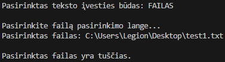
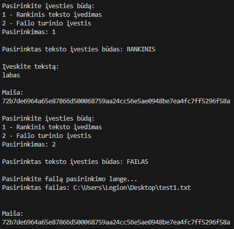
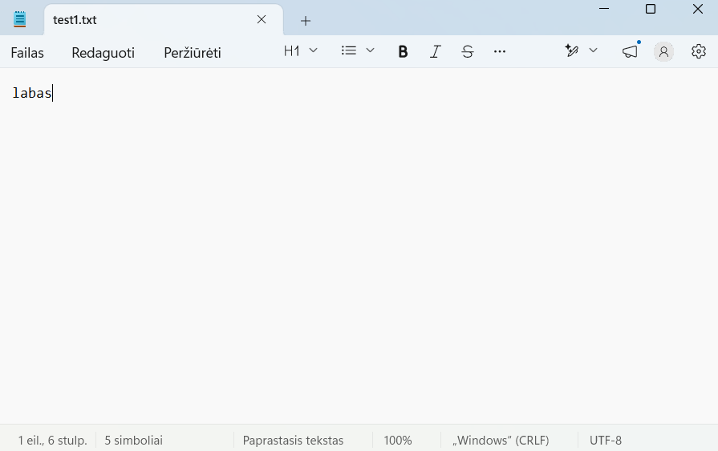
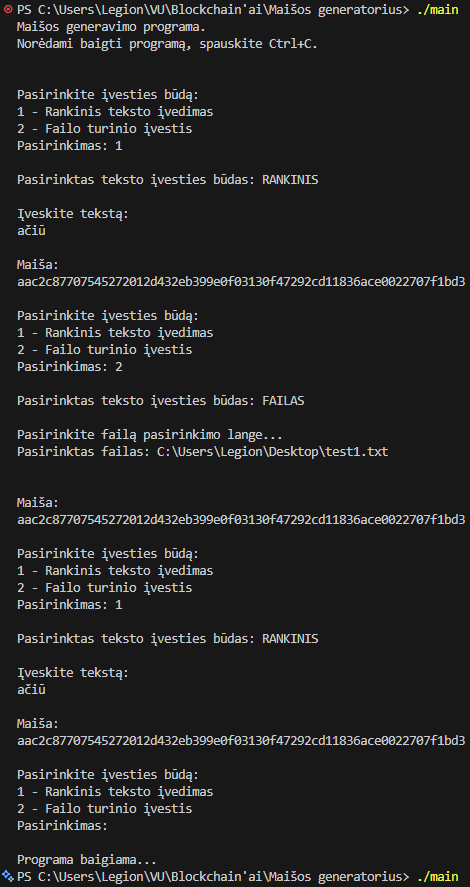
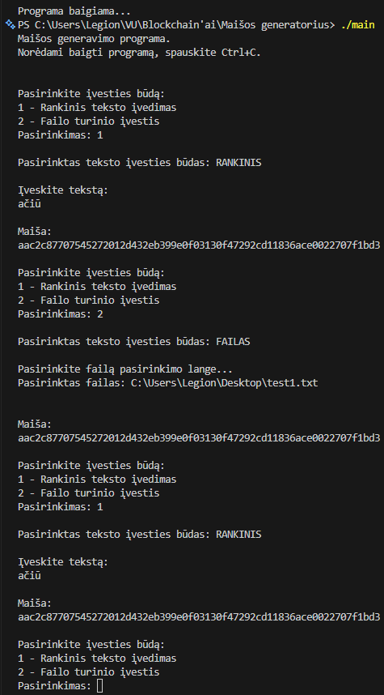

# Maišos generatorius

## Apie programą

- **Programos tikslas:** generuoti įvesto teksto maišą.
- Priimama tiek rankinis įvedimas (terminale), tiek failo įvestis (failą pasirenkant failų dialoge).
- Išvedama 256 bitų ilgio (32 šešioliktainių sk.) maiša, sugeneruota pagal įvestį.

## Eksperimentai

### 1. Skirtingos įvestys

#### 1. Tuščias failas

- Turinys: tuščias failas
- Išvestis: 

#### 2. Vieno baito failai

- Turinys: a
- Išvestis: 19b57af4e8e88000009c2850a0fc881020c8204080a93264c88bb66cd888b060

- Turinys: b
- Išvestis: ed59d2a4489e9c38705e9c387042a448909a54a8501efcf8f05af4e8d0f42850

#### 3. ASCII >1000 baitų failai

##### 1. Lorem Ipsum tekstas (1311 B)

- Turinys (originalus):
  - Lorem ipsum dolor sit amet, consectetur adipiscing elit, sed do eiusmod tempor incididunt ut labore et dolore magna aliqua. Ut enim ad minim veniam, quis nostrud exercitation ullamco laboris nisi ut aliquip ex ea commodo consequat. Duis aute irure dolor in reprehenderit in voluptate velit esse cillum dolore eu fugiat nulla pariatur. Excepteur sint occaecat cupidatat non proident, sunt in culpa qui officia deserunt mollit anim id est laborum. Sed ut perspiciatis unde omnis iste natus error sit voluptatem accusantium doloremque laudantium, totam rem aperiam, eaque ipsa quae ab illo inventore veritatis et quasi architecto beatae vitae dicta sunt explicabo. Nemo enim ipsam voluptatem quia voluptas sit aspernatur aut odit aut fugit, sed quia consequuntur magni dolores eos qui ratione voluptatem sequi nesciunt. Neque porro quisquam est, qui dolorem ipsum quia dolor sit amet, consectetur, adipisci velit, sed quia non numquam eius modi tempora incidunt ut labore et dolore magnam aliquam quaerat voluptatem. Ut enim ad minima veniam, quis nostrum exercitationem ullam corporis suscipit laboriosam, nisi ut aliquid ex ea commodi consequatur? Quis autem vel eum iure reprehenderit qui in ea voluptate velit esse quam nihil molestiae consequatur, vel illum qui dolorem eum fugiat quo voluptas nulla pariatur?
- Išvestis: b2e90fb6eccaf3503955c22790d5121e386d0ae2a504d23ebd4df94552be22cf

- Turinys (pakeistas pradžios baitas):
  - Korem ipsum dolor sit amet, consectetur adipiscing elit, sed do eiusmod tempor incididunt ut labore et dolore magna aliqua. Ut enim ad minim veniam, quis nostrud exercitation ullamco laboris nisi ut aliquip ex ea commodo consequat. Duis aute irure dolor in reprehenderit in voluptate velit esse cillum dolore eu fugiat nulla pariatur. Excepteur sint occaecat cupidatat non proident, sunt in culpa qui officia deserunt mollit anim id est laborum. Sed ut perspiciatis unde omnis iste natus error sit voluptatem accusantium doloremque laudantium, totam rem aperiam, eaque ipsa quae ab illo inventore veritatis et quasi architecto beatae vitae dicta sunt explicabo. Nemo enim ipsam voluptatem quia voluptas sit aspernatur aut odit aut fugit, sed quia consequuntur magni dolores eos qui ratione voluptatem sequi nesciunt. Neque porro quisquam est, qui dolorem ipsum quia dolor sit amet, consectetur, adipisci velit, sed quia non numquam eius modi tempora incidunt ut labore et dolore magnam aliquam quaerat voluptatem. Ut enim ad minima veniam, quis nostrum exercitationem ullam corporis suscipit laboriosam, nisi ut aliquid ex ea commodi consequatur? Quis autem vel eum iure reprehenderit qui in ea voluptate velit esse quam nihil molestiae consequatur, vel illum qui dolorem eum fugiat quo voluptas nulla pariatur?
- Išvestis: 12894f36ec8a7350399542279095921e38ad8ae2a5c4523ebd8d7945527ea2cf

- Turinys (pakeistas vidurio baitas):
  - Lorem ipsum dolor sit amet, consectetur adipiscing elit, sed do eiusmod tempor incididunt ut labore et dolore magna aliqua. Ut enim ad minim veniam, quis nostrud exercitation ullamco laboris nisi ut aliquip ex ea commodo consequat. Duis aute irure dolor in reprehenderit in voluptate velit esse cillum dolore eu fugiat nulla pariatur. Excepteur sint occaecat cupidatat non proident, sunt in culpa qui officia deserunt mollit anim id est laborum. Sed ut perspiciatis unde omnis iste natus error sit voluptatem accusantium doloremque laudantium, totam rem aperiam, eaque ipsa quae ab illo inventore veritatis et quasi architecto beatae vitae dicta sUnt explicabo. Nemo enim ipsam voluptatem quia voluptas sit aspernatur aut odit aut fugit, sed quia consequuntur magni dolores eos qui ratione voluptatem sequi nesciunt. Neque porro quisquam est, qui dolorem ipsum quia dolor sit amet, consectetur, adipisci velit, sed quia non numquam eius modi tempora incidunt ut labore et dolore magnam aliquam quaerat voluptatem. Ut enim ad minima veniam, quis nostrum exercitationem ullam corporis suscipit laboriosam, nisi ut aliquid ex ea commodi consequatur? Quis autem vel eum iure reprehenderit qui in ea voluptate velit esse quam nihil molestiae consequatur, vel illum qui dolorem eum fugiat quo voluptas nulla pariatur?
- Išvestis: 5835a7e6549a9390d9954227e075529f2a51d2759bf0aaf69d0d795fd6c6323b

- Turinys (pakeistas pabaigos baitas):
  - Lorem ipsum dolor sit amet, consectetur adipiscing elit, sed do eiusmod tempor incididunt ut labore et dolore magna aliqua. Ut enim ad minim veniam, quis nostrud exercitation ullamco laboris nisi ut aliquip ex ea commodo consequat. Duis aute irure dolor in reprehenderit in voluptate velit esse cillum dolore eu fugiat nulla pariatur. Excepteur sint occaecat cupidatat non proident, sunt in culpa qui officia deserunt mollit anim id est laborum. Sed ut perspiciatis unde omnis iste natus error sit voluptatem accusantium doloremque laudantium, totam rem aperiam, eaque ipsa quae ab illo inventore veritatis et quasi architecto beatae vitae dicta sunt explicabo. Nemo enim ipsam voluptatem quia voluptas sit aspernatur aut odit aut fugit, sed quia consequuntur magni dolores eos qui ratione voluptatem sequi nesciunt. Neque porro quisquam est, qui dolorem ipsum quia dolor sit amet, consectetur, adipisci velit, sed quia non numquam eius modi tempora incidunt ut labore et dolore magnam aliquam quaerat voluptatem. Ut enim ad minima veniam, quis nostrum exercitationem ullam corporis suscipit laboriosam, nisi ut aliquid ex ea commodi consequatur? Quis autem vel eum iure reprehenderit qui in ea voluptate velit esse quam nihil molestiae consequatur, vel illum qui dolorem eum fugiat quo voluptas nulla pariatur!
- Išvestis: 39f72bead49a9386252d726790d512c0fcf519e52b10e715eba9a7aa9c522cf9

##### 2. Pavyzdinis angliškas tekstas (pirminis tekstas — 1086 B)

- Turinys (originalus):
  - Far far away, behind the word mountains, far from the countries Vokalia and Consonantia, there live the blind texts. Separated they live in Bookmarksgrove right at the coast of the Semantics, a large language ocean. A small river named Duden flows by their place and supplies it with the necessary regelialia. It is a paradisematic country, in which roasted parts of sentences fly into your mouth. Even the all-powerful Pointing has no control about the blind texts it is an almost unorthographic life One day however a small line of blind text by the name of Lorem Ipsum decided to leave for the far World of Grammar. The Big Oxmox advised her not to do so, because there were thousands of bad Commas, wild Question Marks and devious Semikoli, but the Little Blind Text didn't listen. She packed her seven versalia, put her initial into the belt and made herself on the way. When she reached the first hills of the Italic Mountains, she had a last view back on the skyline of her hometown Bookmarksgrove, the headline of Alphabet Village and the subline of her own road, the Line Lane.
- Išvestis: 70a66700a772b9df2b4cae1f85ece8d5e6e0f0f5170e5e9cd569ecdb15dbd1b6

- Turinys (pakeistas pradžios baitas):
  - Par far away, behind the word mountains, far from the countries Vokalia and Consonantia, there live the blind texts. Separated they live in Bookmarksgrove right at the coast of the Semantics, a large language ocean. A small river named Duden flows by their place and supplies it with the necessary regelialia. It is a paradisematic country, in which roasted parts of sentences fly into your mouth. Even the all-powerful Pointing has no control about the blind texts it is an almost unorthographic life One day however a small line of blind text by the name of Lorem Ipsum decided to leave for the far World of Grammar. The Big Oxmox advised her not to do so, because there were thousands of bad Commas, wild Question Marks and devious Semikoli, but the Little Blind Text didn't listen. She packed her seven versalia, put her initial into the belt and made herself on the way. When she reached the first hills of the Italic Mountains, she had a last view back on the skyline of her hometown Bookmarksgrove, the headline of Alphabet Village and the subline of her own road, the Line Lane.
- Išvestis: d6801b68772e31cf0b60d66f252860c5c69458c5b72a960cb5bd942bb5d7c9a6

- Turinys (pakeistas vidurio baitas):
  - Far far away, behind the word mountains, far from the countries Vokalia and Consonantia, there live the blind texts. Separated they live in Bookmarksgrove right at the coast of the Semantics, a large language ocean. A small river named Duden flows by their place and supplies it with the necessary regelialia. It is a paradisematic country, in which roasted parts of sentences fly into your mouth. Even the all-powerful Pointing has no control about the blind texts it is an almost unorthographic life One day however a small line of blind text by the name of Lorem Ipsum decided to leave for the far World of Grammar. The Big oxmox advised her not to do so, because there were thousands of bad Commas, wild Question Marks and devious Semikoli, but the Little Blind Text didn't listen. She packed her seven versalia, put her initial into the belt and made herself on the way. When she reached the first hills of the Italic Mountains, she had a last view back on the skyline of her hometown Bookmarksgrove, the headline of Alphabet Village and the subline of her own road, the Line Lane.
- Išvestis: c44eb7a0f712f95f5bac6e9f150c28569844b88a61a286fbd365e4f911d3c11f

- Turinys (pakeistas pabaigos baitas):
  - Far far away, behind the word mountains, far from the countries Vokalia and Consonantia, there live the blind texts. Separated they live in Bookmarksgrove right at the coast of the Semantics, a large language ocean. A small river named Duden flows by their place and supplies it with the necessary regelialia. It is a paradisematic country, in which roasted parts of sentences fly into your mouth. Even the all-powerful Pointing has no control about the blind texts it is an almost unorthographic life One day however a small line of blind text by the name of Lorem Ipsum decided to leave for the far World of Grammar. The Big Oxmox advised her not to do so, because there were thousands of bad Commas, wild Question Marks and devious Semikoli, but the Little Blind Text didn't listen. She packed her seven versalia, put her initial into the belt and made herself on the way. When she reached the first hills of the Italic Mountains, she had a last view back on the skyline of her hometown Bookmarksgrove, the headline of Alphabet Village and the subline of her own road, the Line Lane?
- Išvestis: 73ac6f5047b22e897ff3dbb9b9535065061e3ccdc76a87aef9a6b8b3c51b449c

#### 4. Struktūruoti atvejai

##### 1. Pasikartojantys simboliai

- Turinys: aaaaaaaaaaaaaaa
- Išvestis: 37b674f064ff7562b16793f00880b01e76e6462eca016fc3a08f6e927adfae7d

- Turinys: aaaaaaaaaaaaaa
- Išvestis: 2fa6542916633e606ddf881da2b425325eb60d92129104409a84b5198800071a

- Turinys: AAAAAAAAAAAAAAA
- Išvestis: eef4c059de455370a526e86f6eb1770c4a8375743ec8dc548ae7a209a8c90e6a

- Turinys: AAAAAAAAAAAAAA
- Išvestis: ff160534d4312c16b13e1bb0303587feeecb1fce7230fa83e8a406aaea50d98b

##### 2. Pakeista simbolių tvarka

- Turinys: ab
- Išvestis: 654b256ad4bc36cc98c1f0c080992468d0c18c38705304c890780a54a83d6e1c

- Turinys: ba
- Išvestis: 3cf58d2a54b2dc68d013a234680ffa840823ee6cd8fb5f9e3c58eb76ec5ed448

- Turinys: abcd
- Išvestis: 60818fb71600bad4b6bdddef00d981069890c1a4e4ba970682d819b9d40af5e5

- Turinys: bacd
- Išvestis: 3527ef6776b6e070ee0f8f63e84f5722d0f325dc5472121caeb8fadb182b5c13

- Turinys: abdc
- Išvestis: fca9df5363ea8e71aebdddd1dc01d04a2922e4dd4fb080b1f31a943a2710e566

- Turinys: dcba
- Išvestis: df433f2bfa99f2fe7a1b4bd9409a58a0522893ea1e09ad47de2215efce7544ff

##### 3. Tarpai pradžioje ir pabaigoje

- Turinys: "Ačiū"
- Išvestis: d2763047a780aa2261b14b3ed335186011e86452522dd1036a6e40a2706ffb93

- Turinys: " Ačiū"
- Išvestis: 7234bab85977a0eaa95ae3af1df53920b71a5a49f2218b8f00b544f38cdc0742

- Turinys: "Ačiū "
- Išvestis: 74bab8235ff08a2669c1697e533512703128d282b2ed1c9186a50f287c854af9

\* kabutės į įvesties turinį neįtrauktos

##### 4. Tekstas su naujos eilutės simboliu ir be jo

- Turinys:
  - Visi žmonės gimsta laisvi ir lygūs savo orumu ir teisėmis. Jiems yra suteiktas protas ir sąžinė, ir jie turi elgtis vienas su kitu kaip broliai.
- Išvestis: 21768594f9181851310df0522ae15989cb59d2c8bd2481c24037719640bb5e78

- Turinys: [tas pats tekstas, bet su nauja eilute po teksto]
- Išvestis: df727d84db5ca06157d988829c45211921852a78bf2889d44c4fa1fbbeb75679

- Turinys: [tas pats tekstas, bet su nauja eilute prieš tekstą]
- Išvestis: 0bec8cb1f1826abca765b5401c55b706621dfd1bd7d91c7624fc6feffa8bd2b4

### 2. Išvesties formatas

#### 1. Maišos ilgis ir hex formatas

- Kiekvienos maišos ilgis lygus 256 bitams = 32 baitams (žr. visus maišos pavyzdžius 1-ajame eksperimente).
- 32 baitai užrašomi 64 šešioliktainiais skaitmenimis, 2 skaitmenys kiekvienam baitui. Juose išlaikomi pradiniai nuliai. Pvz.:
  - teksto "ba" maiša (baitai atskirti tarpais): 3c f5 8d 2a 54 b2 dc 68 d0 13 a2 34 68 **0f** fa 84 **08** 23 ee 6c d8 fb 5f 9e 3c 58 eb 76 ec 5e d4 48

#### 2. Vienoda įvestis ranka ir iš failo

- Įvestis: labas
- Įvedus ranka gaunama maiša: 72b7de6964a65e87866d500068759aa24cc56e5ae0948be7ea4fc7ff5296f58a
- Įvedus failu gaunama maiša: 72b7de6964a65e87866d500068759aa24cc56e5ae0948be7ea4fc7ff5296f58a
- Komandų eilutėje:
  - 
- Failo turinys:
  - 

### 3. Determinizmas

Programos pakartojimai matomi dviejose žemiau esančiose nuotraukose. Bet kokiu atveju vienoda įvestis duoda tą pačią maišą.

### 4. Efektyvumo matavimas

| Eilių sk. | Baitų sk. | 1 bandymo trukmė (s) | 2 bandymo trukmė (s) | 3 bandymo trukmė (s) | 4 bandymo trukmė (s) | 5 bandymo trukmė (s) | Vidurkis (s) | Sklaida (s) |
| --------- | --------- | -------------------- | -------------------- | -------------------- | -------------------- | -------------------- | ------------ | ----------- |
| 1         | 71        | 1.78e-05             | **1.72e-05**         | 1.74e-05             | 1.81e-05             | **2.3e-05**          | 1.87e-05     | 5.8e-06     |
| 2         | 124       | 2.11e-05             | **1.71e-05**         | 1.74e-05             | 1.74e-05             | **2.36e-05**         | 1.932e-05    | 6.5e-06     |
| 4         | 206       | **1.74e-05**         | 1.75e-05             | 1.75e-05             | **2.27e-05**         | 1.78e-05             | 1.858e-05    | 5.3e-06     |
| 8         | 363       | **1.89e-05**         | 1.83e-05             | 1.84e-05             | **1.82e-05**         | 1.83e-05             | 1.842e-05    | 7e-07       |
| 16        | 997       | **2.9e-05**          | 2.23e-05             | 2.72e-05             | 2.77e-05             | **2.12e-05**         | 2.548e-05    | 7.8e-06     |
| 32        | 1842      | 2.41e-05             | 2.42e-05             | **3.13e-05**         | **2.38e-05**         | 2.42e-05             | 2.552e-05    | 7.5e-06     |
| 64        | 3713      | 3.2e-05              | 3.17e-05             | 3.22e-05             | **3.16e-05**         | **3.25e-05**         | 3.2e-05      | 9e-07       |
| 128       | 9156      | **5.31e-05**         | 5.39e-05             | **6.21e-05**         | 5.71e-05             | 5.35e-05             | 5.594e-05    | 9e-06       |
| 256       | 20410     | 9.89e-05             | **9.85e-05**         | 9.92e-05             | **0.0001026**        | 0.0001016            | 0.00010016   | 0.41e-05    |
| 512       | 47435     | 0.0002122            | 0.0002079            | 0.0002114            | **0.0002233**        | **0.0002075**        | 0.00021246   | 1.58e-05    |
| 789       | 75596     | **0.0003427**        | 0.0003208            | **0.0003195**        | 0.0003213            | 0.0003274            | 0.00032634   | 2.32e-05    |

| Eilių sk. | Baitų sk. | 1 bandymo trukmė (s) | 2 bandymo trukmė (s) | 3 bandymo trukmė (s) | 4 bandymo trukmė (s) | 5 bandymo trukmė (s) | Vidurkis (s) | Sklaida (s) |
| --------- | --------- | -------------------- | -------------------- | -------------------- | -------------------- | -------------------- | ------------ | ----------- |
| 1         | 71        | 0.0000178            | **0.0000172**        | 0.0000174            | 0.0000181            | **0.000023**         | 0.0000187    | 0.0000058   |
| 2         | 124       | 0.0000211            | **0.0000171**        | 0.0000174            | 0.0000174            | **0.0000236**        | 0.00001932   | 0.0000065   |
| 4         | 206       | **0.0000174**        | 0.0000175            | 0.0000175            | **0.0000227**        | 0.0000178            | 0.00001858   | 0.0000053   |
| 8         | 363       | **0.0000189**        | 0.0000183            | 0.0000184            | **0.0000182**        | 0.0000183            | 0.00001842   | 0.0000007   |
| 16        | 997       | **0.000029**         | 0.0000223            | 0.0000272            | 0.0000277            | **0.0000212**        | 0.00002548   | 0.0000078   |
| 32        | 1842      | 0.0000241            | 0.0000242            | **0.0000313**        | **0.0000238**        | 0.0000242            | 0.00002552   | 0.0000075   |
| 64        | 3713      | 0.000032             | 0.0000317            | 0.0000322            | **0.0000316**        | **0.0000325**        | 0.000032     | 0.0000009   |
| 128       | 9156      | **0.0000531**        | 0.0000539            | **0.0000621**        | 0.0000571            | 0.0000535            | 0.00005594   | 0.000009    |
| 256       | 20410     | 0.0000989            | **0.0000985**        | 0.0000992            | **0.0001026**        | 0.0001016            | 0.00010016   | 0.0000041   |
| 512       | 47435     | 0.0002122            | 0.0002079            | 0.0002114            | **0.0002233**        | **0.0002075**        | 0.00021246   | 0.0000158   |
| 789       | 75596     | **0.0003427**        | 0.0003208            | **0.0003195**        | 0.0003213            | 0.0003274            | 0.00032634   | 0.0000232   |
